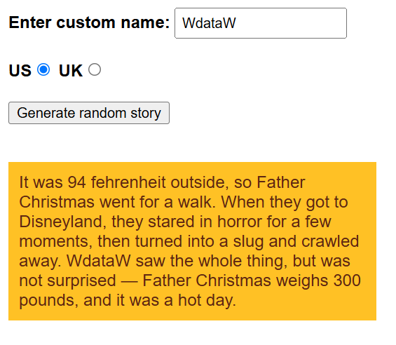

# story-generator
the program generates a somewhat random story. it picks a character, place, and phrase randomly from an array to put the story together.
NOTE: this project is a part of [MDN tutorials]{https://developer.mozilla.org/en-US/docs/Web/JavaScript/Reference/Global_Objects/Array/slice} 

[Live Demo](https://wdataw.github.io/mdn-story-generator/)

## Features:
- allows the user to enter a custom name to be included in the story.
- allows switching between US and UK units mentioned in the story.

## Built With:
- html.
- css.
- Javascript.
